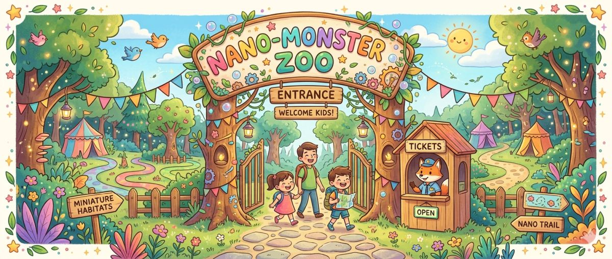

# nano-zoo
A zoo for nano-monsters. Made for the Kids-Hackathon 2026 in Zürich.

## Skill Workflow (Kurz)
Die vollständige Skill-Dokumentation mit Prompts und Workflow findest du in der Datei [docs/skill-doku.md](docs/skill-doku.md).

Die Anforderungen fuer Teilnehmende am Hackathon findest du in [docs/User-Requirements.md](docs/User-Requirements.md).

Ein kindgerechtes Glossar mit Erklärungen zu Fachbegriffen findest du in [docs/glossar.md](docs/glossar.md).